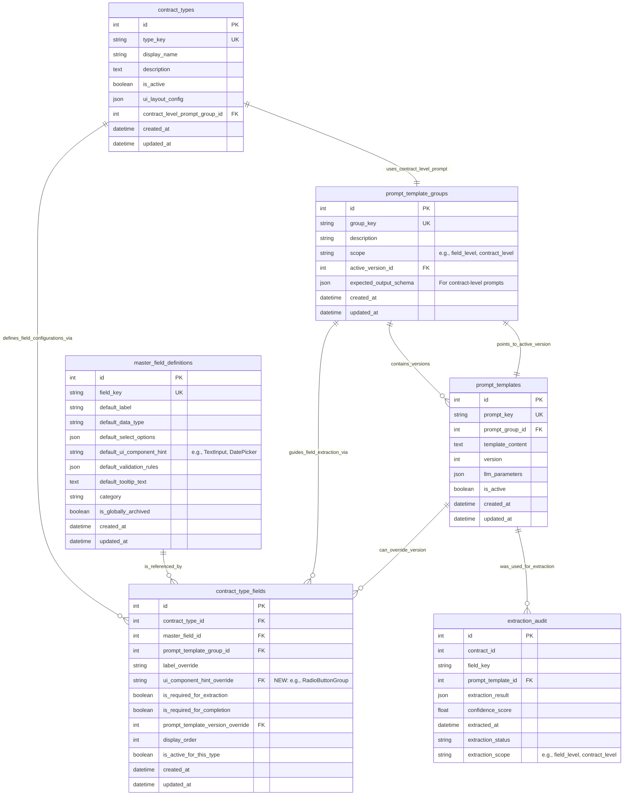

```mermaid
erDiagram
    contract_types {
        int id PK
        string type_key UK
        string display_name
        text description
        boolean is_active
        json ui_layout_config
        int contract_level_prompt_group_id FK
        datetime created_at
        datetime updated_at
    }

    master_field_definitions {
        int id PK
        string field_key UK
        string default_label
        string default_data_type
        json default_select_options
        string default_ui_component_hint "e.g., TextInput, DatePicker"
        json default_validation_rules
        text default_tooltip_text
        string category
        boolean is_globally_archived
        datetime created_at
        datetime updated_at
    }

    prompt_template_groups {
        int id PK
        string group_key UK
        string description
        string scope "e.g., field_level, contract_level"
        int active_version_id FK
        json expected_output_schema "For contract-level prompts"
        datetime created_at
        datetime updated_at
    }

    prompt_templates {
        int id PK
        string prompt_key UK
        int prompt_group_id FK
        text template_content
        int version
        json llm_parameters
        boolean is_active
        datetime created_at
        datetime updated_at
    }

    contract_type_fields {
        int id PK
        int contract_type_id FK
        int master_field_id FK
        int prompt_template_group_id FK
        string label_override
        string ui_component_hint_override FK "NEW: e.g., RadioButtonGroup"
        boolean is_required_for_extraction
        boolean is_required_for_completion
        int prompt_template_version_override FK
        int display_order
        boolean is_active_for_this_type
        datetime created_at
        datetime updated_at
    }

    extraction_audit {
        int id PK
        int contract_id
        string field_key
        int prompt_template_id FK
        json extraction_result
        float confidence_score
        datetime extracted_at
        string extraction_status
        string extraction_scope "e.g., field_level, contract_level"
    }

    contract_types ||--o{ contract_type_fields : "defines_field_configurations_via"
    contract_types ||--|| prompt_template_groups : "uses_contract_level_prompt"
    master_field_definitions ||--o{ contract_type_fields : "is_referenced_by"
    prompt_template_groups ||--o{ contract_type_fields : "guides_field_extraction_via"
    prompt_template_groups ||--o{ prompt_templates : "contains_versions"
    prompt_template_groups ||--|| prompt_templates : "points_to_active_version"
    prompt_templates ||--o{ contract_type_fields : "can_override_version"
    prompt_templates ||--o{ extraction_audit : "was_used_for_extraction"
```
